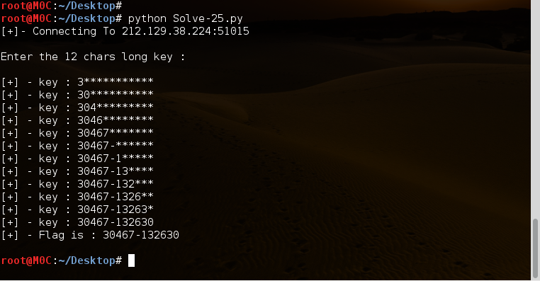

######- Auteur : Mimo-0xC001
######- www.fb.com/0xc00l
######- Category : CryptAnalyse
######- Points : 25
######- Titre : Service - Timing attack


-

 > Salam,
 >
 > Service - Timing attack
 >
 > Retrouvez la clé de 12 caractères permettant de vous authentifier sur le service réseau.
 >
 > - Hôte         :   challenge01.root-me.org
 >
 > - Procotole    :   TCP
 >
 > - Port         :   51015

-


En essayons de résoudre ce challenge,, la première piste à suivre c'est en se basant sur le titre ... :p'
( à vrai dire le titre c'est la solution et non pas un point de départ ... xD' )

voila,, maintenant qu'on a compris qu'il s'agit d'une attaque "Timing-attack" ... on doit préparer un petit script qui va faire l'affaire !

le consept est assez simple,, on envoit à chaque fois une lettre et on calcule le temps de la réponse ... puis en fonction du temps on prend la lettre correct,, on l'ajoute à notre key et on passe à la lettre suivante !!

vous pouvez écrire un script vous même,, voila ci-dessous j'ai essayé d'écrire un simple script j'espère qu'il vous sera utile :)'


-

```python

#!/usr/bin/env python

#Service - Timing attack
#Mimo-0xC001
#www.fb.com/0xC00l

import socket
import time

def getFlag():
 TCP_IP= '212.129.38.224'  #ip of challenge01.root-me.org
 TCP_PORT= 51015
 BUFFER_SIZE=1024
 
 print "[+]- Connecting To %s:%d\n" % (TCP_IP,TCP_PORT)
 s = socket.socket(socket.AF_INET, socket.SOCK_STREAM)
 s.connect((TCP_IP, TCP_PORT))
 data = s.recv(BUFFER_SIZE)
 print data
 
 chars="0123456789-"
 time_char=0
 char_found=''
 key=''
 
 for i in range(12):
  for c in chars:
   s.send(key+c)
   debut=time.time()
   data = s.recv(BUFFER_SIZE)
   fin=time.time()
   diff=fin-debut
   if(diff>time_char):
     time_char=diff
     char_found=c
  key+=char_found
  time_char=0
  print "[+] - key : " + key + "*"*(11-i)
 s.close()
 return key

def main():
 print "[+] - Flag is : %s\n" % (getFlag())

if __name__ == '__main__':
   main()

```

-

[Solve-25.py](./Solve-25.py)

Résultat du script :

-




J'espère que ce write-up vous sera utile,, Salam :)'
